# Module 1 — Password Cracking with JTR (John the Ripper + Johnny)

**Task:** Crack the password of the attached PDF files using JTR John and
JTR Johnny on Windows.

**Tools:**
- [John the Ripper (jumbo)](https://www.openwall.com/john/) — CLI engine (`john.exe`)
- [Johnny](https://openwall.info/wiki/john/johnny) — GUI front-end for JTR
- [OnlineHashCrack PDF Hash Extractor](https://www.onlinehashcrack.com/tools-pdf-hash-extractor.php) — runs `pdf2john` in the browser to turn a locked PDF into a crackable hash

## Setup

1. Download John the Ripper (jumbo, Windows x64 build) from openwall.com and
   extract it.
2. Download and install the Johnny GUI.
3. Open Johnny → **Settings** → **Browse** → point "John the Ripper
   executable" at `john.exe` inside the extracted JTR `run` folder.
   Johnny confirms detection, e.g. *"Detected John the Ripper
   1.9.0-jumbo-1 OMP [cygwin 64-bit x86_64 AVX2 AC]"*.

   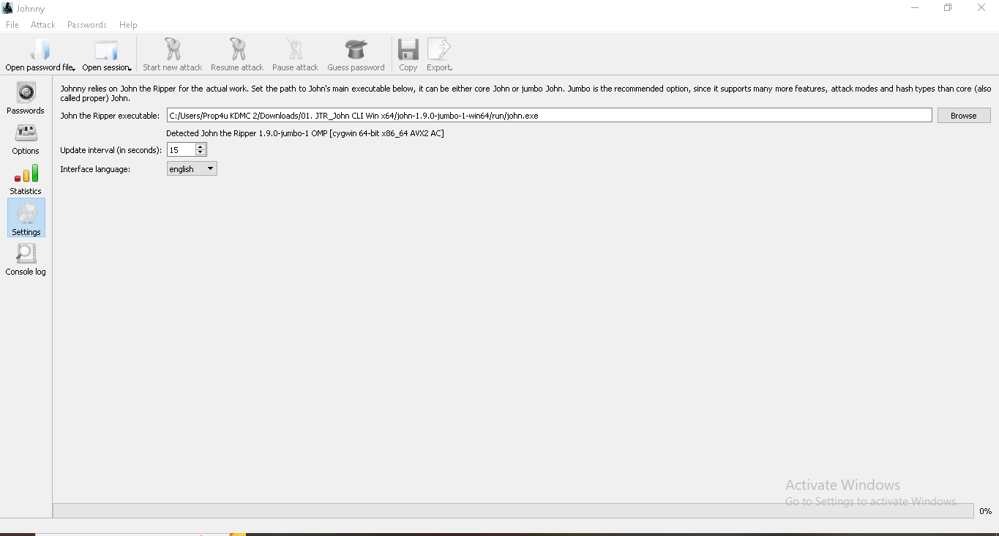

## Per-file procedure

The same five steps were repeated for **PDF1**, **PDF2**, and **PDF3**.

1. **Extract the hash** — upload the locked PDF to the OnlineHashCrack PDF
   Hash Extractor. It runs `pdf2john` server-side and returns a hash string
   starting with `$pdf$...`.
2. **Save the hash** — copy the output, paste into Notepad, and save as
   `hash<N>.txt` (UTF-8, plain text).
3. **Load into Johnny** — in Johnny, **Open password file → Open password
   file (PASSWD format)**, browse to the saved `hash<N>.txt`.
4. **Start the attack** — click **Start new attack**. Johnny/JTR runs a
   dictionary attack against the PDF hash until it finds a match, then shows
   the cracked password in the **Password** column (progress bar reaches
   100%, *"1 cracked, 0 left"*).
5. **Open the PDF** — use the recovered password to unlock the PDF in a PDF
   reader (Word/Acrobat) and capture the flag printed on the first page.

### PDF1 — password `good-luck`

| Step | Evidence |
|---|---|
| Extract hash | 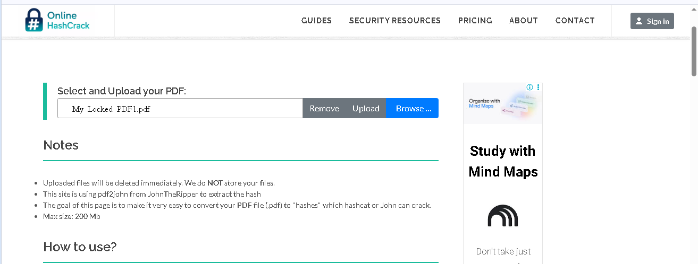 → 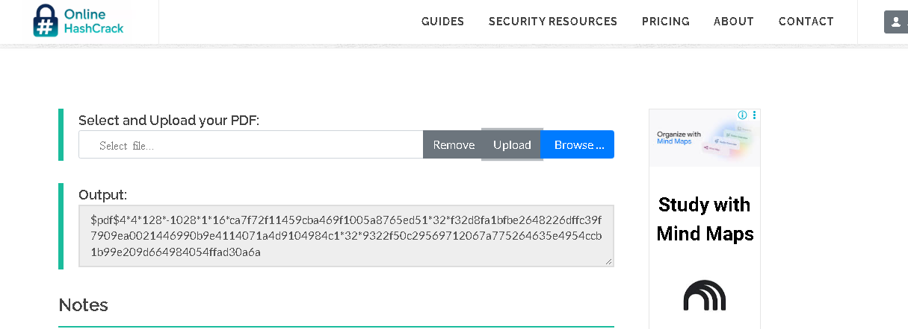 |
| Save as `hash1.txt` | 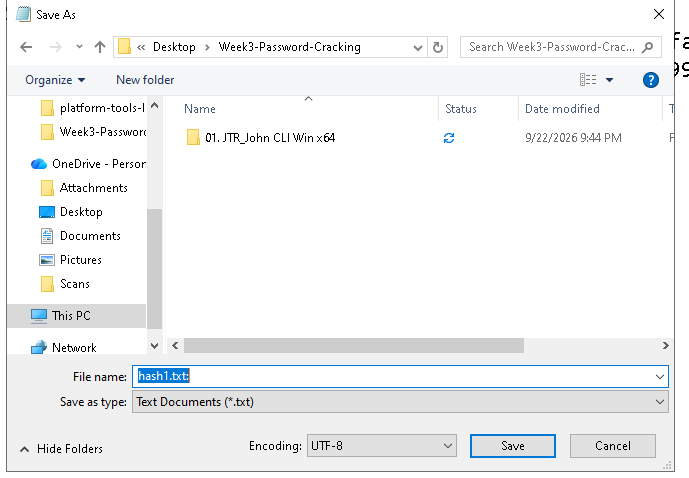 → 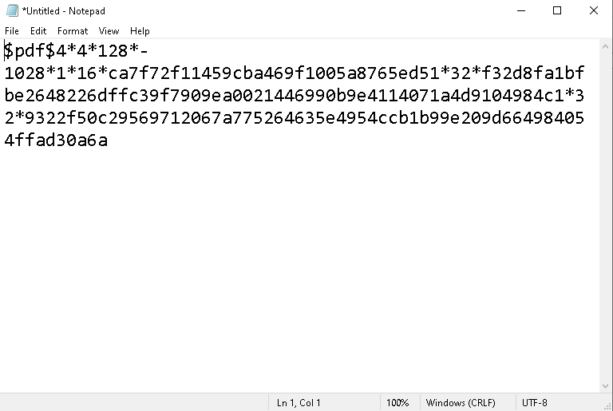 |
| Load in Johnny |  |
| Password cracked | 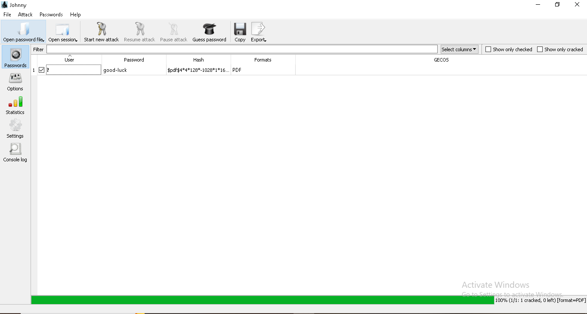 |
| Password entered in PDF reader | 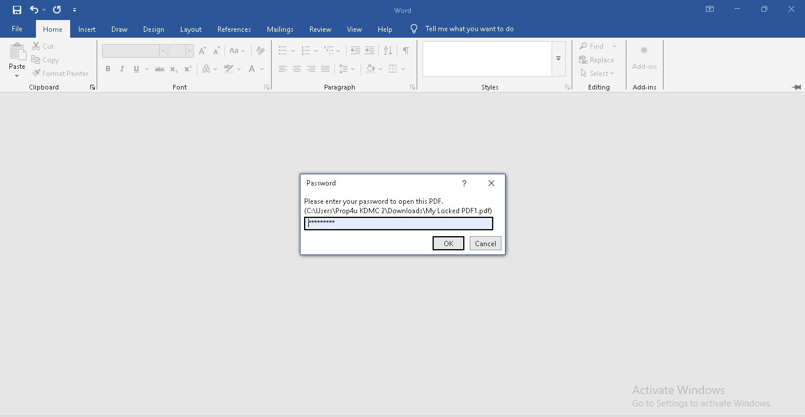 |
| Flag captured |  |

**Flag:** `nw{cybersecurity_flag_captured_2608}`
Hash used: [`hashes/hash1.txt`](../hashes/hash1.txt)

### PDF2 — password `password1`

| Step | Evidence |
|---|---|
| Extract hash | 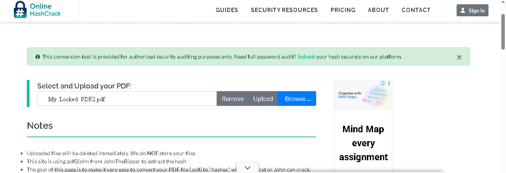 → 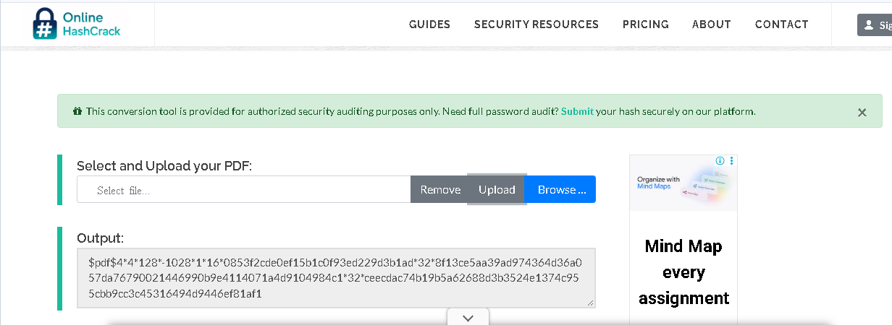 |
| Save as `hash2.txt` | 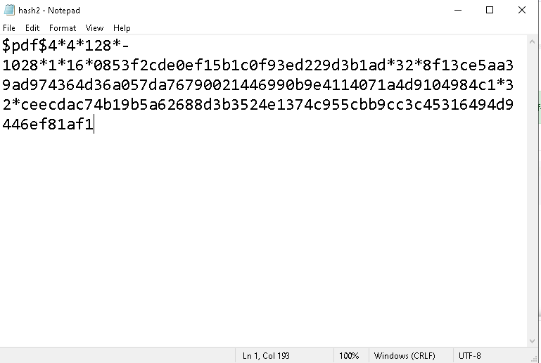 |
| Load in Johnny |  → 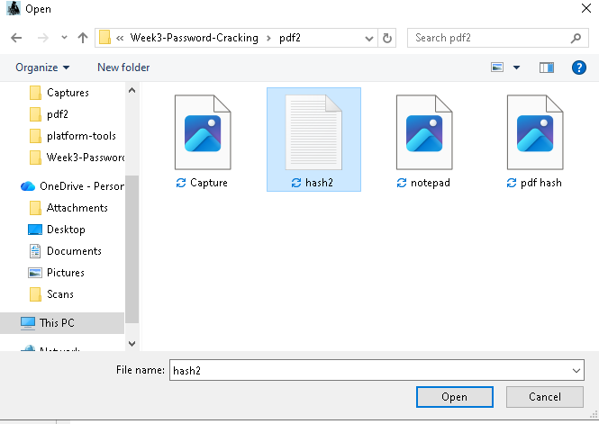 |
| Password cracked | 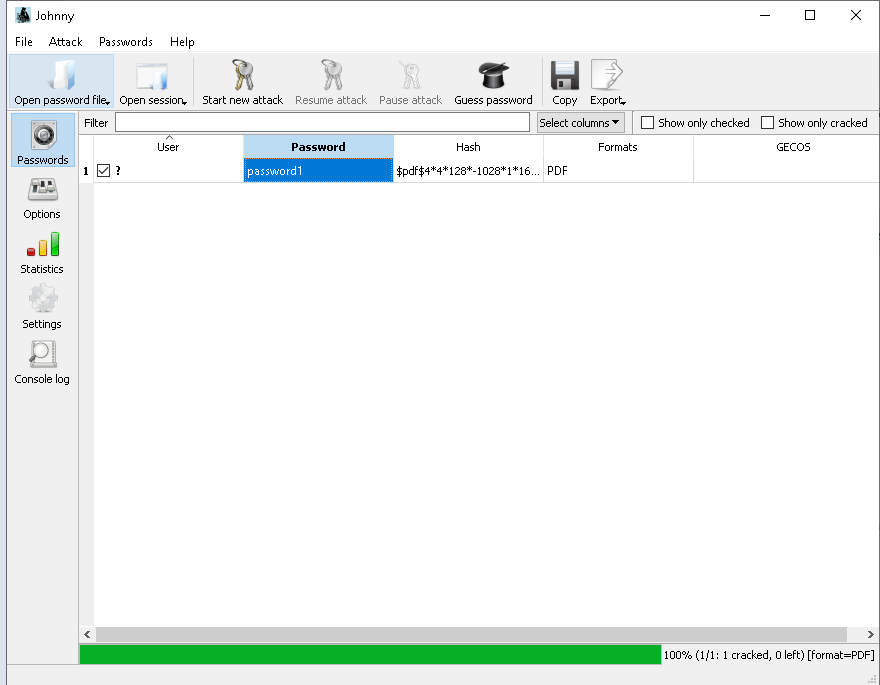 |
| Password entered in PDF reader | 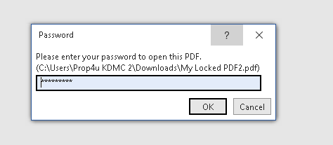 |
| Flag captured |  |

**Flag:** `nw{networkwalks_persistence_jtr_270521}`
Hash used: [`hashes/hash2.txt`](../hashes/hash2.txt)

### PDF3 — password `1qaz2wsx`

| Step | Evidence |
|---|---|
| Extract hash | 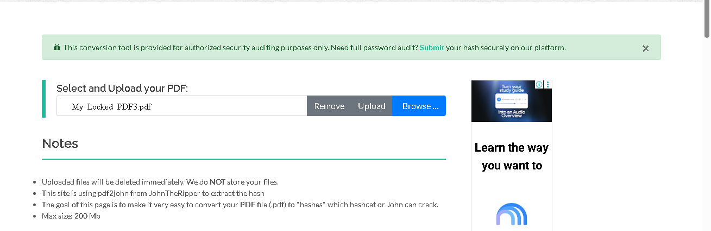 → 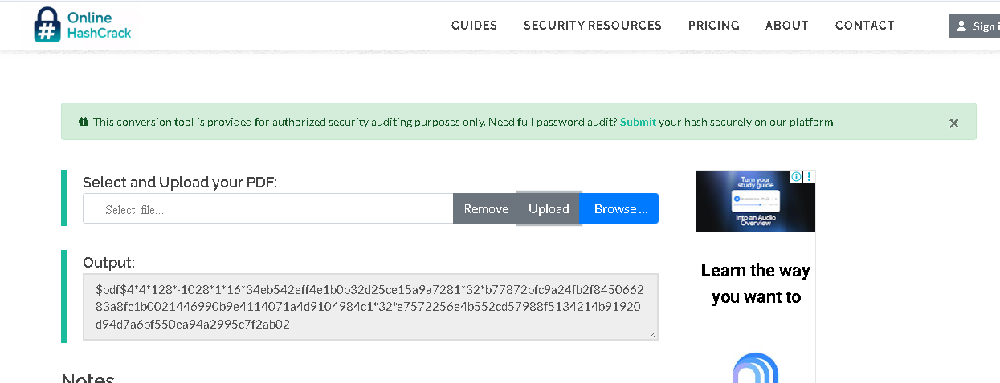 |
| Save as `hash3.txt` | 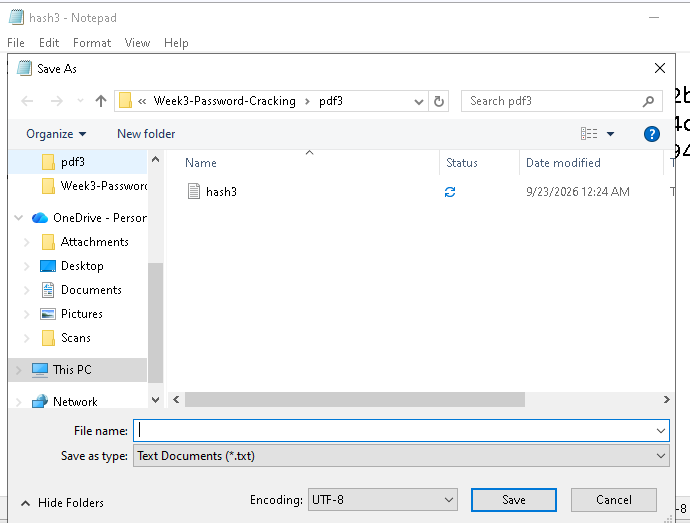 → 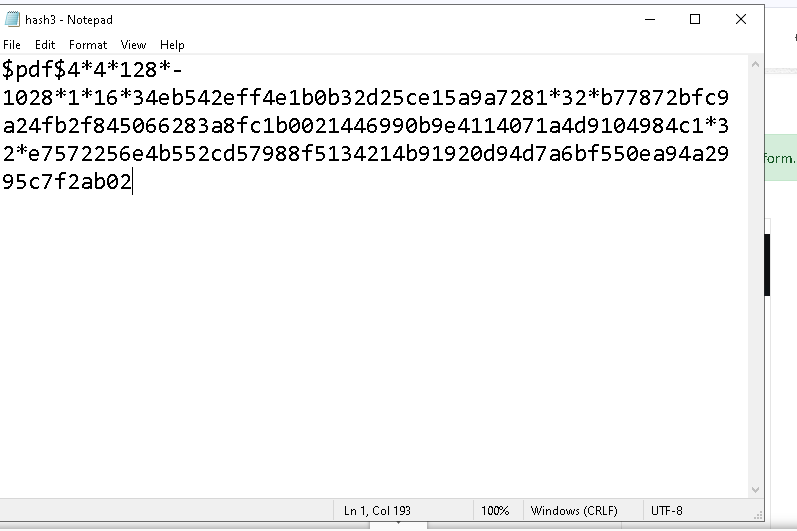 |
| Load in Johnny | 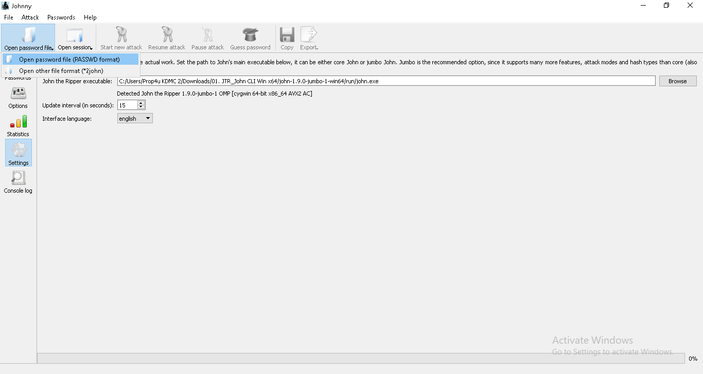 → 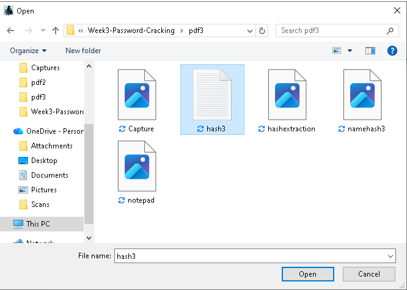 |
| Password cracked | 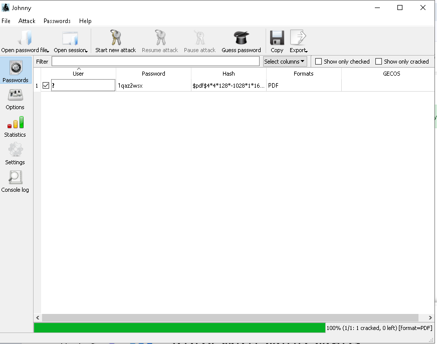 |
| Password entered in PDF reader | 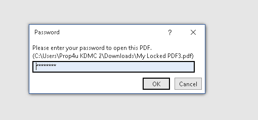 |
| Flag captured |  |

**Flag:** `nw{networkwalks_flag_260821_1}`
Hash used: [`hashes/hash3.txt`](../hashes/hash3.txt)

## Notes

- The hash format used throughout is `$pdf$4*4*128*-1028*1*16*...` — a
  128-bit RC4, revision 4 PDF encryption hash, compatible with both JTR
  (`--format=PDF`) and hashcat.
- If the extracted hash has a stray `b'` prefix from a Python byte-string
  repr, it must be stripped before saving — otherwise JTR fails to parse it.
