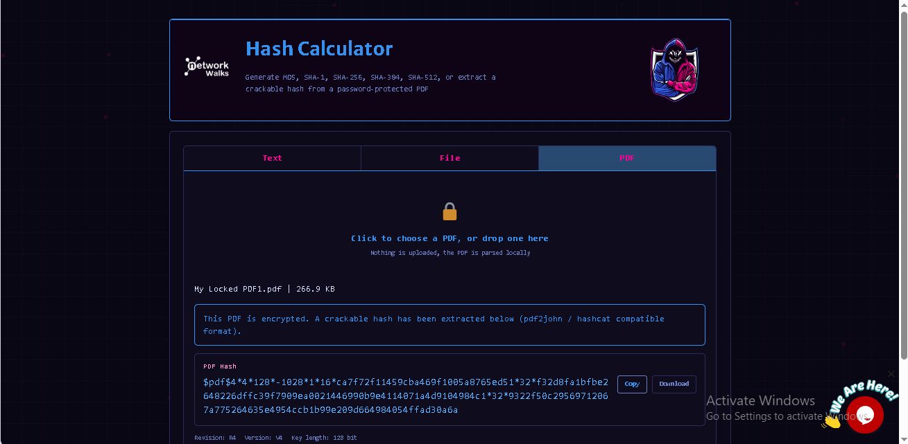
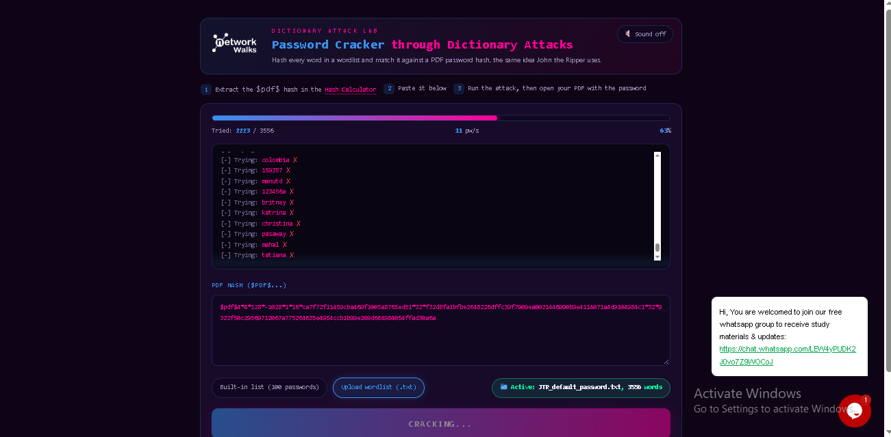
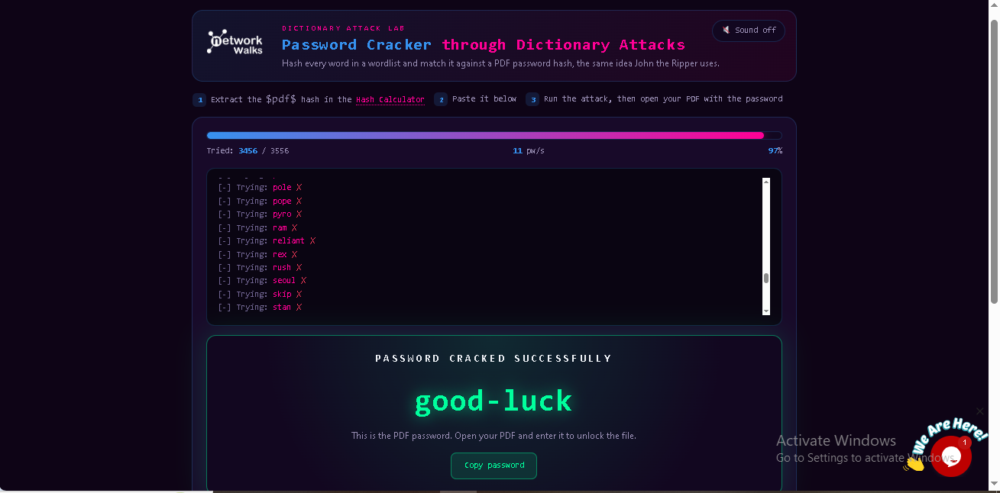
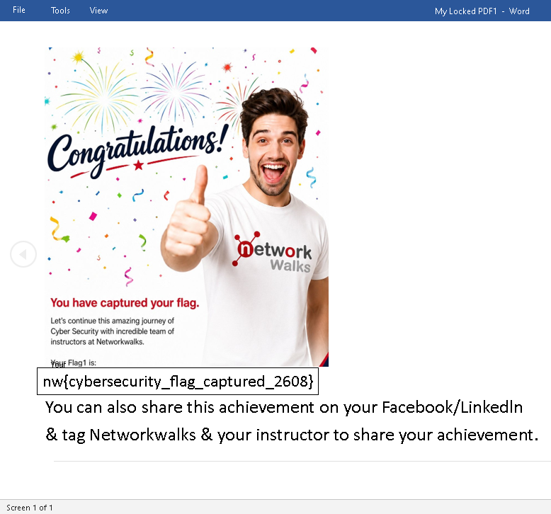
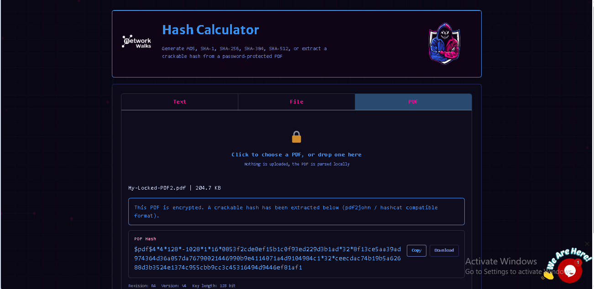
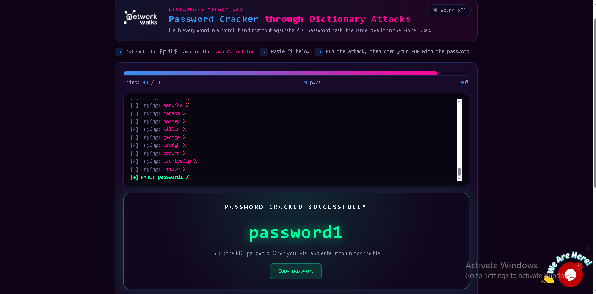
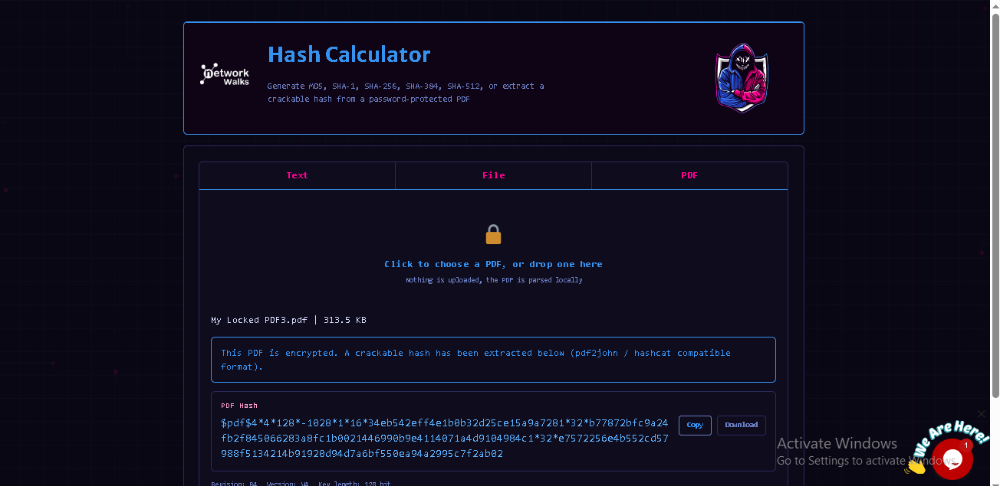
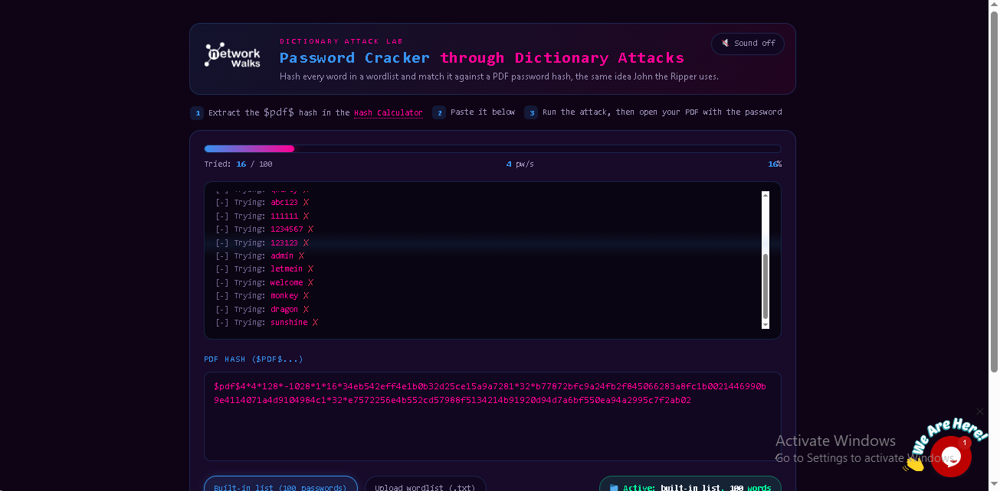
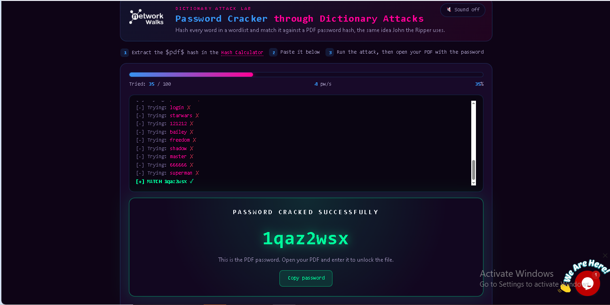

# Module 2 — Password Cracking with Networkwalks Tools

**Task:** Crack the password of the attached PDF files using the
Networkwalks **Hash Calculator** and **Password Cracker** browser tools —
no local install required.

**Tools:**
- Networkwalks Hash Calculator — `https://networkwalks.com/hash-calculator/`
  (extracts a `pdf2john`/hashcat-compatible hash from a locked PDF, parsed
  locally in the browser, nothing uploaded)
- Networkwalks Password Cracker — `https://networkwalks.com/password-cracker/`
  (runs a dictionary attack against a pasted `$pdf$...` hash, the same idea
  as John the Ripper)

## Per-file procedure

The same three steps were repeated for **PDF1**, **PDF2**, and **PDF3**.

1. **Extract the hash** — open the Hash Calculator, go to the **PDF** tab,
   upload the locked PDF. The tool detects encryption and returns a
   crackable hash (`$pdf$4*4*128*-1028*1*16*...`).
2. **Run the dictionary attack** — copy the hash into the Password Cracker,
   choose a wordlist (built-in list or an uploaded `.txt` wordlist, e.g.
   `JTR_default_password.txt`), and click **Start Cracking**. The tool
   streams each attempt (`Trying: ...`) until it finds a match.
3. **Open the PDF** — use the recovered password to unlock the PDF and
   capture the flag on the first page.

### PDF1 — password `good-luck`

| Step | Evidence |
|---|---|
| Hash extracted |  |
| Dictionary attack running |  |
| Password cracked |  |
| Flag captured |  |

**Flag:** `nw{cybersecurity_flag_captured_2608}`

### PDF2 — password `password1`

| Step | Evidence |
|---|---|
| Hash extracted |  |
| Password cracked |  |
| Flag captured |  |

**Flag:** `nw{networkwalks_persistence_jtr_270521}`

### PDF3 — password `1qaz2wsx`

| Step | Evidence |
|---|---|
| Hash extracted |  |
| Dictionary attack running |  |
| Password cracked |  |
| Flag captured |  |

**Flag:** `nw{networkwalks_flag_260821_1}`

## Notes

- This module mirrors Module 1's outcome (same PDFs, same passwords, same
  flags) but swaps local JTR/Johnny for two in-browser Networkwalks tools —
  demonstrating that the same `$pdf$...` hash format is portable between
  cracking tools.
- The Password Cracker reports progress as `Tried: X / Y` and a `pw/s` rate,
  and highlights the successful attempt as `[+] MATCH <password> ✓`.
